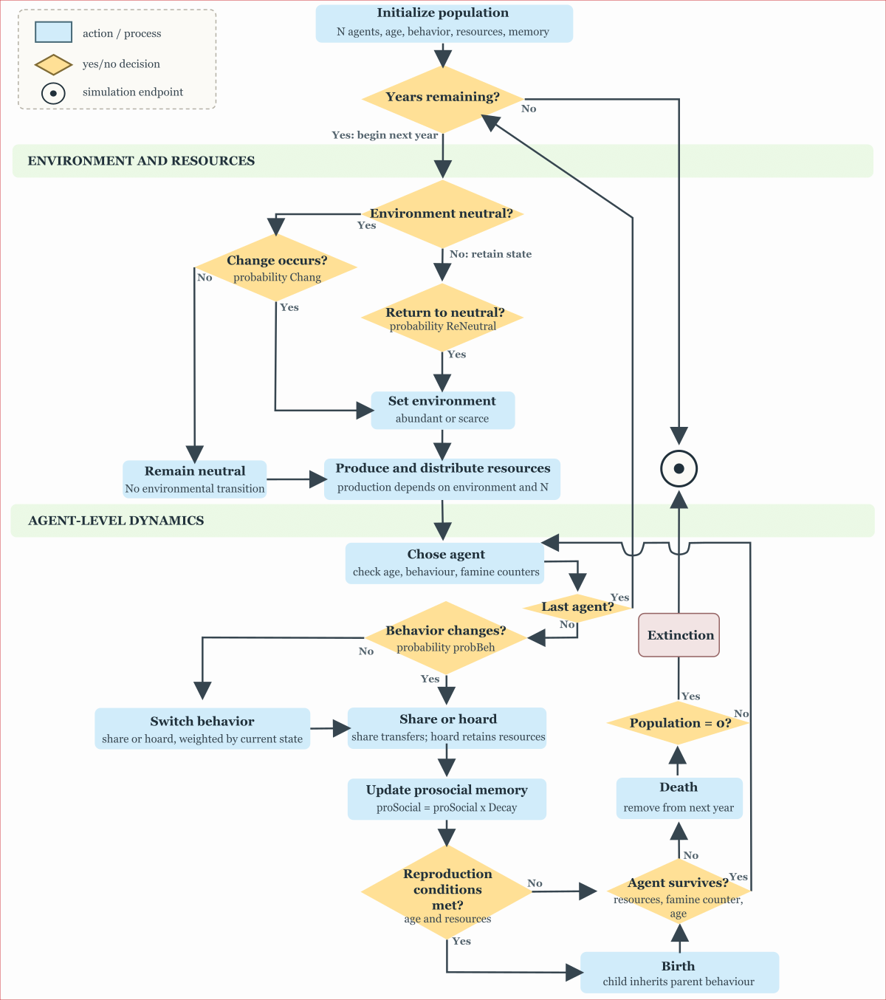
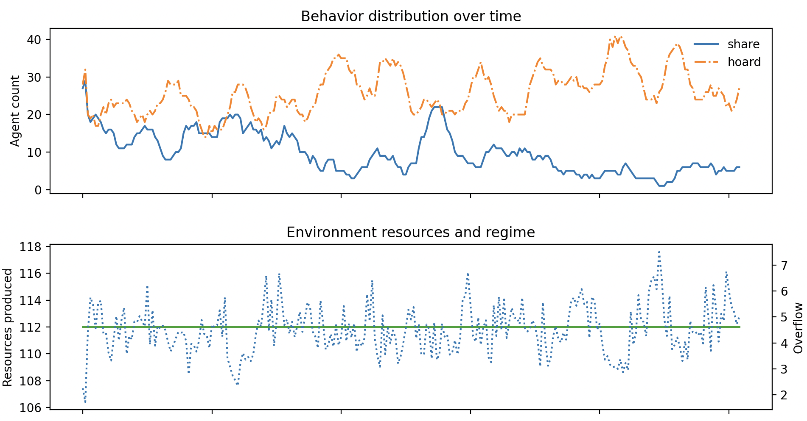
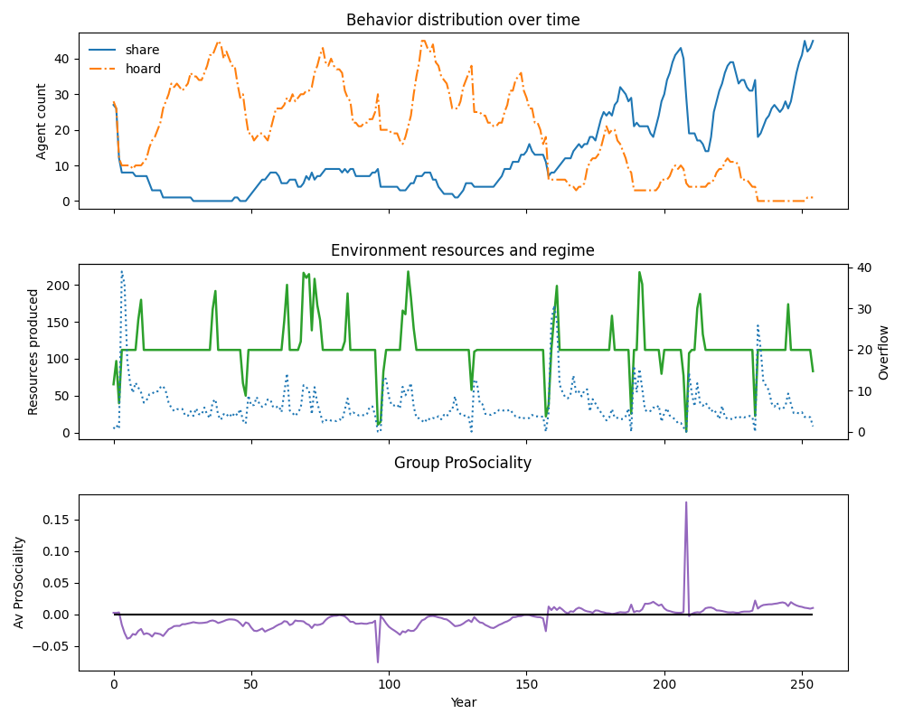
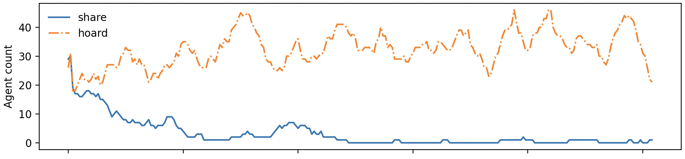
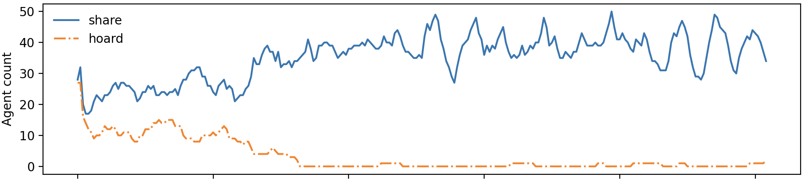
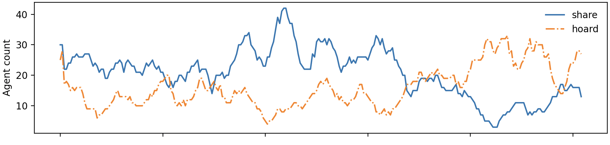
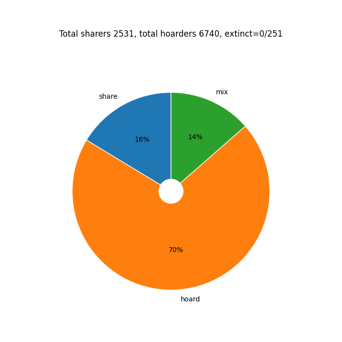
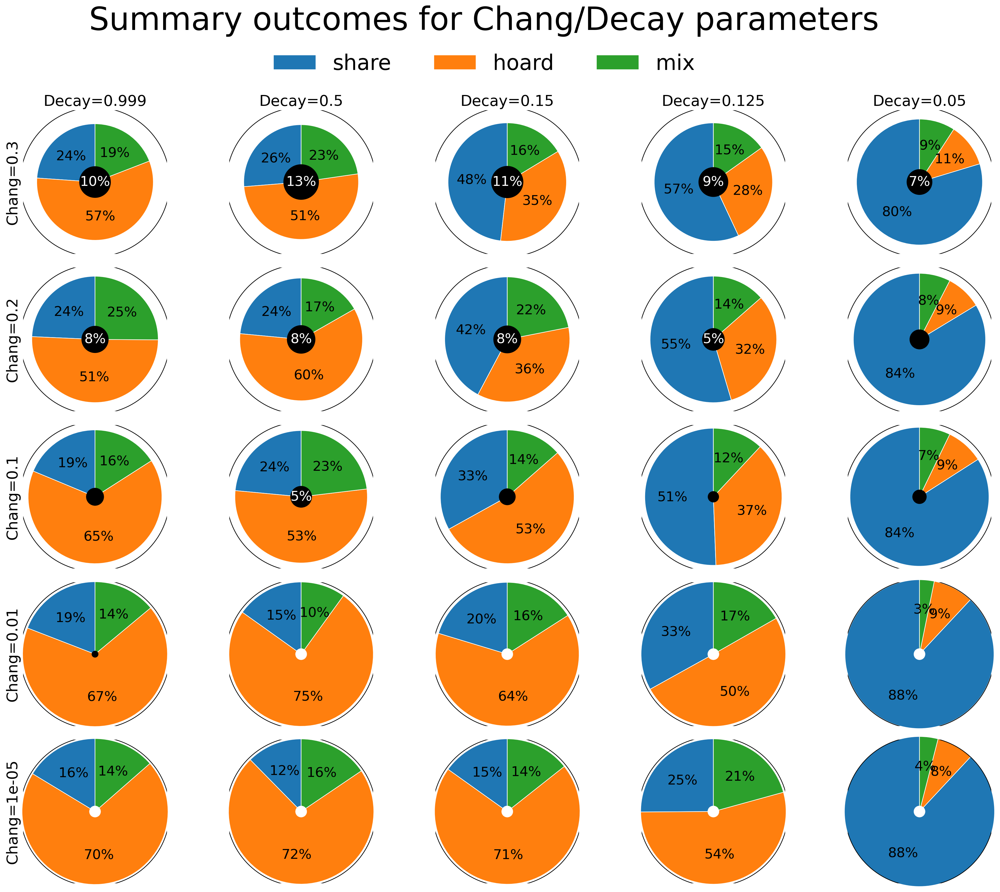

# proSocial Documentation

## 1. What is proSocial simulation?

proSocial is a computer simulation about how people-like agents may behave when resources, social relationships, memory, and environmental conditions change.

It is not a model of one specific historical society and it does not predict individual human behavior. It is a controlled thought experiment.

The model focuses on two behavioral tendencies that can change with provability $P_b$ and environmental change that fluctuates within three levels, with probability $P_c$

### Environmental change: neutral, abundant, scarce

The environment switches among neutral, abundant, and scarce conditions. These states determine how many resources become available. They are deliberately simple abstractions that ideally could be constrained by empirical data.

- **Neutral:** the environment produces slightly more resources than the needed for the intitial population. These resources are distributed between tha agents according to age ranges and a random fluctuation.
- **Abundant:** the environment produces multiple times more resources than needed for the initial population.
- **Scarce:** the environment produces significantly less resources than needed by the initial population. 

The environment changes from neutral to scarce or abundant between environments with a probability of change $P_c$. With a probability  of return to neutral $P_{rn}$ returns to the neutral environment.

### Agent caracteristics: behavioural change, collective memory, death and reproduction.

The model represents one narrow form of cooperation: transferring resources to another agent. This is not a complete theory of cooperation. It does not directly represent language, norms, punishment, institutions, kinship, reputation in the human sense, or conscious intention.

#### Behaviour change

- **Sharing:** an agent gives some resources to another agent.
- **Hoarding:** an agent keeps resources rather than transferring them.

Any given year the behaviour can change with a probability $P_b$.

Sharing is a resource transfer from an agent with sufficient resources to another agent. The amount transferred is controlled by `ShareFraction`. The receiver is selected using the model's social-memory value.

#### Collective memory

Memory is represented by one numeric value, `proSocial`. It is increased or decreased through social behavior and reduced over time by `Decay`. This is a computational proxy for persistence of social information, not a psychological measure of episodic memory, working memory, or cultural memory.

Unlike many game theory settings, were each agent has to remember the state of everybody else, the proSocial model assumes that, agents have a simple form of collective memory of the previous sharing or hoarding behaviours of each agent.

We assume this group memory humans tend to continuously share and update information by talking and gossiping within groups. That way the burden of keeping track of all behavioural actions of agents is shared in a kind of collective mind, which is accessed when deciding with whom to share extra resources.

Humans can proceed with this kind of collective information updating, unlike many other animals, thanks to our sofisticate language which conveys much more meaning than other animal communication systems. 

This group memory decays at each time step, controlled by a decay parameter $d$. This collective memory affects whom the sharing behaviour chooses as a recipient of sharing.

#### Death 
Initially, the age distribution of the population follows that of an average hunter-gatherer band.

Agents die depending on wether they have enough resources to survive periods where there are not enough resources for all the population, and also die out of old age or as infants.

Agents have a famine counter, years where they have not enough resources they do not die immediately but only after scarcity affects them continuously (2-3 years).

#### Reproduction

The agents have reproductive maturity and reproductive end, both controlled by how old they are, with relative random component.

The agents all can reproduce (equivalent to looking at the female side of the population). The probability of reproduction depends on how much extra resources the parent agent has, with more resources making it more likely.

If an agent has enough extra resources for a child, the reproduction can happen once per year, and is limited to one children agent per parent, with a small probability of twins if they have the resources.

Reproduction is modeled as a resource-dependent event available within a configured age range. Children generally inherit the parent's behavior. This is a simplified inheritance rule and should not be read as a biological account of human behavior.

## 2. Methods

### Individual simulation

One simulated population is run through time $T$, in years, using one configuration of the parameters.

This level is useful for asking:

- What happens in one possible social history?
- When do resources become abundant or scarce?
- How do sharing and hoarding change over time?
- Does the population persist, grow, or disappear?

*Fig. 1. Flow diagram summarising the main run of a simulation, from setting agents and environment to the end of the simulation, either because the time, in years, has ended, or no population remains, the population becomes extinct.*

The individual simulation produces a time-series plot. It shows the changing number of sharers and hoarders, how Prosocial the population is, the environmental state and how much extra resources the agents have beyond what is needed.

A single run is of illustrative because many random factors affects the specific result.

*Fig. 2. Simulation result for a neutral, non changing, environment.*

In the simulation above (Fig 2), in the top panel we can see the fluctuation of number of agents with different behaviours. An agent needs to share above the mean overflow of resources, otherwise is not suitable for receiving resources form other sharers. If no agent is suitable for receiving resources, the sharer gives randomly to someone in the group, even if an agent which is consistently hoarding.

Young agents at half the reproductive age always receive the minimum amount of resources for them to survive that year, i.e. 16/2 yrs. Similarly, old agents, at an age above end of reproduction age plus half that age i.e. 42+42/2 yrs.

*Fig. 3. Simulation with changing environment.*

When the simulation with changing environment we can see spikes of abundance and wells of scarcity. In spikes, the resources to share can be multiplied by 2 for one or multiple years. In wells, the resources can go up to 0 for one or multiple levels. 

In the middle panel, we overplot the average overflow of resources. We can see that there is a correlation between in overflow and shifts from scarcity to neutral and neutral to abundant, and especially from scarcity to abundant (years 160-170 in Fig. 3). Since, in upward environmental transitions, there are more resources per agent, this translates in these spikes up in overflow.
 
At the bottom panel we show the average prosociality of the group. When the average prosociality is below 0, the group is dominated by hoarding behaviour. When there is scarcity, the average prosociality can rapidly expand if there is substantial sharing by the population. 

The spike in prosociality in year 207-8 (bottom panel) happens when the overflow is small per agent, but agents still share what little extra resources they have, as we can see in the big spike. In that instance, there is a big population with sharing behaviour but little resources per agent. Subsequently, the population is reduced despite the subsequent abundance spike.

### Simulation parameters

The table below distinguishes parameters held fixed for the reference simulations from parameters varied in sensitivity analyses and parameter grids. Fiducial values are used unless otherwise noticed. Where a range is shown, it refers to the grid or exploratory values used in the project. Parameters are held at their fiducial values unless a separate experiment changes them. 

| Parameter name | Symbol | Fiducial value | Unit | Range for variable parameters | Short description |
| --- | --- | ---: | --- | --- | --- |
| **Fixed: initial population** | $N$ | 55 | agents | -- | Number of agents at the beginning of each simulation. |
| **Fixed: simulation duration** | $T$ | 255 | years | -- | Number of yearly simulation steps in one individual run. |
| **Fixed: batch size** | $S$ | 251 | simulations | -- | Number of independent runs for one parameter combination. |
| **Fixed: reporting window** | $T_r$ | 22 | years | -- | Final years averaged to classify a batch run as sharing-dominated, hoarding-dominated, or mixed. |
| **Fixed: basic resource need** | $R_n$ | 2.0 | resource units per agent-year | -- | Minimum resource requirement used in distribution, survival, and reproduction. |
| **Fixed: under-one death rate** | $d_{<1}$ | 0.4 | probability/threshold | -- | Mortality-related parameter used by the slow simulator when evaluating reproduction and early-life survival. |
| **Fixed: reproductive age** | $A_r$ | 16 | years | -- | Mean age at which agents become reproductively eligible. |
| **Fixed: reproductive-age variation** | $\sigma_r$ | 2 | years | -- | Random variation around reproductive age. |
| **Fixed: menopausal age** | $A_m$ | 42 | years | -- | Mean age at which reproductive eligibility ends. |
| **Fixed: menopausal-age variation** | $\sigma_m$ | 2 | years | -- | Random variation around menopausal age. |
| **Fixed: maximum life parameter** | $A_{max}$ | 80 | years | -- | Upper life-history parameter used in age-related mortality. |
| **Fixed: behavior-switch probability** | $P_b$ | 0.005 | probability per year | -- | Probability that an agent considers changing between sharing and hoarding in a year. |
| **Fixed: memory threshold** | $\theta$ | 0.5 | resource-overflow units | -- | Threshold used when selecting agents considered suitable recipients of sharing. |
| **Fixed: maximum storage** | $R_{store}$ | 3.0 | resource units | -- | Upper cap on resources stored by an agent. |
| **Fixed: return-to-neutral probability** | $P_{rn}$ | 0.5 | probability per year | -- | Probability that an abundant or scarce environment returns to neutral. |
| **Fixed: initial share weight** | $w_s$ | 1.0 | relative weight | -- | Initial weight for assigning sharing behavior. |
| **Fixed: initial hoard weight** | $w_h$ | 1.0 | relative weight | -- | Initial weight for assigning hoarding behavior. |
| **Variable: environmental change** | $P_c$ (`Chang`) | 0.00001 | probability per year | $10^{-5}$--0.3 | Probability that a neutral environment changes to abundant or scarce conditions. |
| **Variable: memory decay/retention** | $d$ (`Decay`) | 0.001 | proportion retained per year | 0.001--0.95 | Multiplicative retention of prosocial memory; values closer to 1 retain more memory. |
| **Variable: sharing fraction** | $f_s$ (`ShareFraction`) | 0.5 | fraction/transfer rule | exploratory; typically 0--1 | Controls the amount of surplus resources transferred by a sharing agent. |
| **Variable: maximum abundance** | $R_{abund}^{max}$ (`MaxAbundant`) | 2.0 | resource multiplier | exploratory; typically $\geq 1$ | Upper multiplier for resource production under abundant conditions. |
| **Variable: maximum scarcity** | $R_{scarce}^{min}$ (`MaxScarce`) | 0.0 | resource multiplier | exploratory; typically 0--1 | Lower multiplier for resource production under scarce conditions. |

## 3. Results

### Set of simulations with constant parameter values

A set of simulations is run to compute averages of tendencies. We run the same parameter setting $S$ times. Each run starts the same fraction of sharers and hoarders. 

This level is useful for asking:

- Across many possible histories, how often does a population end mainly in sharing?
- How often does it end mainly in hoarding?
- How often is the result mixed?
- How often does the population become extinct?

To summarize the end of a simulation, we look at just the last generation (last 20 years) and measure the average behaviour to classify the outcome of the simulation in three categories:

- hoarding dominated
- sharing dominated 
- mixed

We determine if a simulation finishes in each of these categories if the average behaviour in the last 20 years dominates by more than 66% of agents behaving that way. If non behaviour is more than 66%, the outcome is considered mixed, i.e. both sharing and hording behaviours are still quite predominant, even is not majority.

*Fig. 4. Simulation with Hoarding behaviour dominating at the end of the run (Hoarders, on  average in the last 20 years, are > 66% of the population).*

 
*Fig. 5. Simulation with Sharing behaviour dominating the end of the simulation (Hoarders, on  average in the last 20 years, are < 33% of the population).*

*Fig. 6. Simulation with neither Hoarding nor Sharing dominating the end of the simulation.*

Once we selected the adobe classification scheme, we run the simulation X times to generate statistics of how many groups, on average, end up being dominated by hoarding, sharing behaviours, or a mixed population. 

The batch plot below is a pie chart. Its slices show the percentage of runs in the categories `share`, `hoard`, and `mix`.

The categories describe the ending of each run, not every moment in its history. A run can contain both sharing and hoarding during its life and still be classified by its late-stage composition.

In the plot below we show the result of running a batch of simulations with no change in environment and a fast decay in memory. In such conditions we would expect the Hoarding behaviour to dominate, as they receive the benefits of sharing at no cost. 

In the plot, 70% of the cases the hoarding behaviour dominates. However, for about 15% of the simulations the sharing or mix populations are present. 

Hoarding does not always dominate because the model has such stocasticity, and is constrained by empirically grounded reproduction and death parameters, that in some occasions a population of sharers is self sustaining for long periods of time. 

Sharers can sustain themselves while the hoarding behaviour does not catch up because the agents holding that behaviour can not overreproduce if there is some stocasticity. 

*Simulation with neither Hoarding nor Sharing dominating the end of the simulation. When non dominates by more than 66% of the behaviour, the population is catalogued as Mixed.*

### Gird of sets of simulations for varying memory decay and environmental change

We look at how the end simulation batches vary when we change paris of parameters. The ones we want to initially test are memory decay and environmental change, and how these affect the composition. 

For the decay, we investigate how the group remembers the prosocial behaviour of each individual.

For environmental change, we investigate how abundance and scarcity events affect the distribution of average behaviours.

In Fig. 8 we show the results. A grid repeats the previous batch procedure across combinations of two parameters. Fig. 8 contains one batch pie for every parameter combination:

- **Chang:** rows from bottom to top  how readily the neutral environment changes to an abundant or scarce state. The values represent do not follow a linear progress.
- **Decay:** columns from left to right, how quickly agents lose social-memory information. The bigger the value the faster the decay. The values represent do not follow a linear progress.

*Fig. 8. Grid of sets of simulations for varying two parameters, environmental change (Chang) and collective memory decay (decay). Colors and numbers represent the behaviour predominance and simulations that end in extinction. Black center, at least one run in the batch ended in extinction. White center with dark outline, no run in the batch ended in extinction. Pie sizes (outlined by thin black line) represent the relative size of the final population of agents. Bigger pies have bigger final population. The current grid varies `Chang` by rows and `Decay` by columns. Other parameters are held at their fiducial values (Table 1).*

The relative size of the whole pie represents the total population observed in that batch. Therefore, a larger pie does not automatically mean more sharing.

The grid is best understood as a map of model behaviour. The plot shows, broadly, where sharing, hoarding, mixed outcomes, or extinction are more common.

## 3. Discussion

### Individual Simulation

A simulation has information on behaviour, prosociality, overflow of resources per agent  and environmental condition.

In a given simulation, even in stable environments where there are enough resources for all the agents, the total population and relative behaviours fluctuate.

These fluctuations are due to the resources being distributed in part randomly at each time step, together with the constrains of human natality and mortality, which impede for a given behaviour to rapidly take over the whole population and stavilise. 

### Simulations set for fixed parameter values

The proSocial simulation has a high degree of stocasticity build into it. To know what of population is likely to end in a given behaviour we can run a batch of simulations and analyse the outcome's percentages.

Notice that a large `share` or `hoard` slice means a large fraction of runs `ended` with a last generation with high share or hoard composition. It does not mean that every agent shared throughout the simulation, nor that sharing produced a better human outcome.

In the case of Fig. 7, we plot the null hypothesis, where the environment has extremely low chance of changing and the group does remember the behaviour of the agents. In the case of no memory, the sharers provide sharers and hoarders equally. 

In the null hypothesis we expect the Hoarding behaviour to dominate in all cases, as hoarding has fitness benefits. However, we see that about 15% of the time either sharers or a mixed behavioural population prevails. 

This prevalence could be a temporal fluctuation, and hoarding can later dominate. But the sharer behaviour would not completely go extinct with the given simulation parameter values, as long as there is a chance of behavioural switch, which currently is a 0.5%. Given that provability, a population that at some point has been dominated by hoarding, could transition to mix or sharing in some circumstances. We interpret the probability of this transitions happening 30% of the time (15% to mixed and 15% to sharing)

### Simulations set for varying environmental chang and collective memory decay

For prosociality, we initially want to investigate how remembering past behaviour of agents affects the provability of a prosocial behaviour dominating a population, and how environmental fluctuations regulates such prevalence.

Fig. 8. Captures the main dynamics that we are intetrested, mainly, how sharing becomes more prevalent as collective memory decays slower and the environment changes more frequently. We also observe seconday efects, like in the cases where sharing is more prevalent the total populaion (pie size) is bigger, and number of extinctions (black circle) is smaller than in hoarding dominated scenarios.

For the main questions, we can look at our null hipothesis (fast decay, no environmental change, bottom left subplot) and see what happens when we either only increase the environmental change (first column) or only decrease decay (bottom row).

#### Increased environmental change, no collective recall
For increasing environmental change, we see a small, but consistent effect where the mix and sharing predominance increases to almost 50% of the instances for chang 0.2, and a bit lower (probably due to stocasticity) for chang 0.3.

We attribute this pattern to the fact that, despite not having memory, hoarding dominate groups are more likely lose population in scarcity years, as there is not much storage capacity. Once there is less hording around, sharing has higher chance of persisting, but without being prevalent, as hoarding still benefits disproportionately from having many memory-less sharing.

We also observe, as expected, that the total population decreases with more environmental change, as agents can not take advantage quick enough of the abundant periods, also, the extra agents in the abundant years die once the environment returns to neutral, and finally, more scarce years also reduce the population.

Similarly, more groups become extinct as the change increases, as it is more likely that a set of scarce years in a row can wipe out all the reproductive adults, and the population just dies.

#### Better collective recall, no environmental change.
For decreasing memory decay only (bottom row), we see a big, but not linear, effect of better collective memory. From the null model to decay of 0.15 there is virtually no change on the prevalence. However, from 0.15 to 0.05 the behavioural prevalence flips, with sharing taking over 88% of the realisations. 

When a group really remembers the prosocial states of the agents, hoarders are much less likely to benefit, while, as said, sharing has more efficient way to distribute resources, so they more easily overgrow hoarding. 

We see this pattern also slightly reflected in the pie size, with the small decay one being the biggest of all, due to sharing behaviour being able to share exes resources so they cover more of the population survival and reproductive needs. 

We also see the "stavilising" effect of that sharing has vs hoarding when we compare the first and last columns. For hoarding, when the environmental fluctuations increase is big the fraction has an almost 20% reduction--from 70% to as low as 51% -- while for sharing, the maximum decrease is a 8%--from 88% to 80%-- less than half. 

#### General trends
Columns 3 and 4 (decay 0.15, 0.125) are illustrative of the effects we are interested in investigating, how small increases in memory at a critical point, and big fluctuations in environment, shape prosociality.

Wen the collective memory is in a threshold state, like in these two columns, an increase in environmental change strongly selects for sharing. For example, the subplot with $10^5$ *change* and 0.15 *decay* is no different than the one with the same *change* but 0.999 decay. However, when *chang* is 0.3, the same difference in *decay* makes the sharing fraction go from about 1/4 to about 1/2.

We can interpret this result as showing that environmental change is pushing sharing above a threshold in which it can outperform hoarding. This interpretation is further reinforced when comparing *decay* at 0.15 to 0.125, with that small shift, the sharing fraction grows to 57% at the expense of hoarding, but not of mix populations.

Finally, similar to having populations, better remembering--and the associated increase in sharing--also seems to protect from group extinctions. On the top two rows, the extinct fraction is reduced 1/3rd and 1/2lf--from 10% to 7% and 8% to 4%,  respectively. 

Again, we interpret this as having populations dominated by sharing being more likely to survive environmental scarcity because sharing distributes the available resources more evenly.

## 4. Future Questions 

With proSocial model, we can explore:

- Under what resource conditions does sharing persist across repeated simulated histories?
- Does longer social-memory retention alter the frequency of sharing-dominant outcomes?
- Are some combinations of environmental change and memory associated with more population extinction?
- Are outcomes stable across nearby parameter values or highly sensitive to small changes?
- How do the dynamics change if the sharing rules are different?, e.g. equal sharing for others, each agent remembers the others prosocial behaviour individually instead of being a collective pool, or remember of prosocial behaviour only in scarcity times.
- How do Abundant and Scarce environmental conditions each individually affect behavioural compositions?
- Introduce "male" agents and expand the model for mate selection linked to evolutive success? 
- How much empirical grounding we can introduce to the model parameters? (collective memory decay of prosociality, environmental resources and needs, amount of storage of extra resources in different societies, capacity to survive famine years, sharing behaviour towards non reproductive elders and non reproductive youngers...).
- Imprement intergroup competition between groups where hoarder behaviour, mix or sharing prevail, and run for evolutionary time to see which kinds of groups are more likey to dominate the landscape. 
- For intergroup competition, model the spatial scale of abundance and scarcity. If a specific abundant or scarce event only affects a handful of groups at a time or dominates the whole landscae. How do these environmental satio-temoral dynamics couple with prosocial behaviour.
- For multi-group scenarios, model how sharing between groups would be implemented. How inter-group sharing is different than inter-individual sharing and how collective memory dynamics play a role at remembering past inter-group dynamics.

## 5. Questions This Model Cannot Answer Alone

The simulation cannot establish:

- whether real humans are naturally cooperative or selfish;
- whether sharing is morally better than hoarding;
- how a real community would respond to a particular crisis;
- whether the model's parameters correspond to measurable psychological traits;
- whether a pattern is universal across cultures or historical periods.

Those conclusions require evidence outside the simulation.

